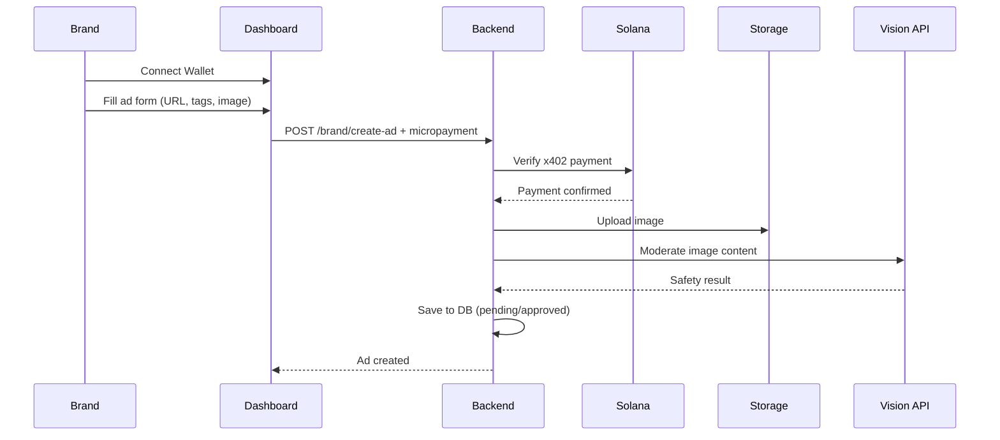
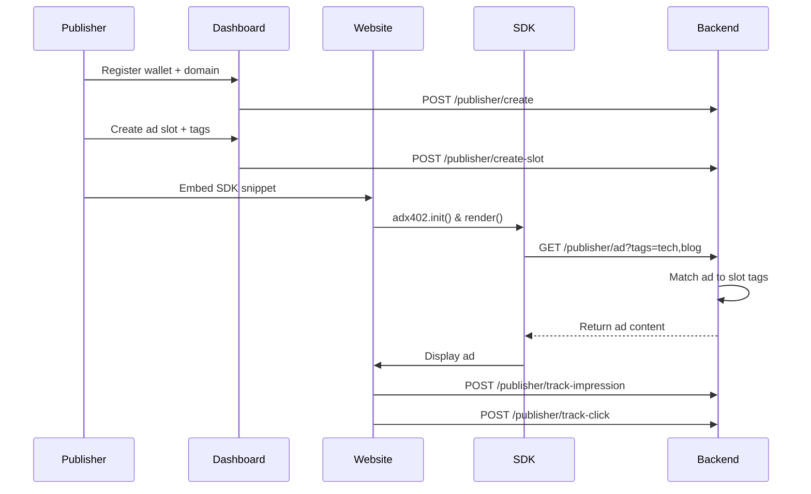

# ADX402

> Frictionless blockchain-powered advertising with micropayments and automated content moderation

**Live Dashboard:** [adx402.ateliertech.xyz](https://adx402.ateliertech.xyz)  
**NPM Package:** [@ateliertech/adx402-sdk](https://www.npmjs.com/package/@ateliertech/adx402-sdk)

Built by **IO AtelierTech**

---

## 🚀 Overview

ADX402 is a decentralized advertising platform that enables brands to publish ads on websites using Solana micropayments (x402 protocol) with automated content moderation. Publishers embed a simple SDK snippet, and ads are matched to their slots based on contextual tags.

## 🏗️ Architecture

This monorepo contains three submodules:

- **`backend/`** - Express API for payment verification, ad matching, and moderation
- **`frontend/`** - Brand dashboard for ad creation and management
- **`sdk/`** - NPM package for publishers to embed ads

---

## 🎯 Key Features

### For Brands

- **Wallet-based authentication** - Connect Solana wallet to publish ads
- **Micropayment publishing** - Pay per ad using x402 protocol
- **Automated moderation** - Google Vision API filters explicit content
- **Tag-based targeting** - Reach relevant audiences

### For Publishers

- **Zero configuration** - Embed a single script tag
- **Tag-based matching** - Ads match your content automatically
- **Wallet rewards** - Earn from impressions and clicks
- **Domain verification** - Secure ad serving

### Technical Highlights

- **Content safety** - Vision API checks for adult, violence, racy, and medical content
- **Blockchain verification** - All payments validated on Solana
- **Real-time matching** - Contextual ad serving based on tags
- **Performance tracking** - Impression and click analytics

---

## 📊 System Flow

### Brand Flow (Ad Creation)



### Publisher Flow (Ad Serving)



---

## 🔧 Quick Start

### For Publishers

1. **Install the SDK:**

```bash
npm install @ateliertech/adx402-sdk
```

2. **Embed on your website:**

```html
<div id="adx-slot"></div>
<script type="module">
  import { adx402 } from "@ateliertech/adx402-sdk";

  adx402.init({
    wallet: "YOUR_WALLET_ADDRESS",
    tags: ["tech", "blog", "tutorial"],
  });

  adx402.render("#adx-slot", {
    aspectRatio: "16x9",
  });
</script>
```

3. **Register your domain** at [adx402.ateliertech.xyz](https://adx402.ateliertech.xyz)

### For Brands

1. Visit [adx402.ateliertech.xyz](https://adx402.ateliertech.xyz)
2. Connect your Solana wallet
3. Fill in ad details (destination URL, tags, image)
4. Send micropayment via x402 protocol
5. Wait for automated moderation approval

---

## 🤝 Contributing

For questions or collaboration:

**IO AtelierTech**  
GitHub: [github.com/io-ateliertech](https://github.com/io-ateliertech)

---

**Built for the future of decentralized advertising** 🚀

